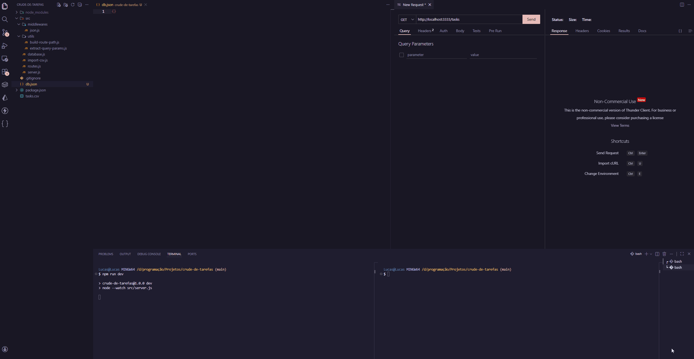

# Demonstração do Projeto



#  Crud de Tarefas

Este projeto é uma API para gerenciamento de tarefas (CRUD), desenvolvida durante meus estudos de fundamentos do **Node.js**. O grande diferencial aqui é a construção de uma aplicação utilizando apenas os módulos nativos do Node (como `http`, `crypto`, `fs`), sem o uso de frameworks como Express, focando profundamente no entendimento de **Streams**, **Buffers** e o funcionamento do protocolo HTTP.


##  Tecnologias e Conceitos Explorados
- **Runtime**: Node.js (v22+)
- **HTTP Nativo**: Criação de rotas, tratamento de parâmetros (Route e Query Params).
- **Streams & Buffers**: Processamento de dados eficiente e leitura de arquivos em pedaços (Chunks).
- **ES Modules**: Organização de código moderna usando `import/export`.
- **Persistência Local**: Banco de dados em arquivo JSON simulando um banco NoSQL.
- **csv-parse**: Implementação de rotas de importação em massa via arquivos CSV.

##  Checklist de Funcionalidades Implementadas
- [x] **POST /tasks**: Criação de tarefas com geração automática de `id`, `created_at` e `updated_at`.
- [x] **GET /tasks**: Listagem de todas as tarefas com suporte a filtros de busca (título/descrição).
- [x] **PUT /tasks/:id**: Atualização de dados com validação de existência do registro.
- [x] **DELETE /tasks/:id**: Remoção de tarefas com validação de ID.
- [x] **PATCH /tasks/:id/complete**: Alternância (Toggle) do status de conclusão.
- [x] **Importação via CSV**: Script de automação que lê um arquivo externo e popula a API.

## Como Executar o Projeto

### 1. Clonar e Instalar
```bash
# Clone o repositório
git clone [https://github.com/lucas-evet/crud-de-tarefas-node.git]

# Entre na pasta
cd crud-de-tarefas-node

# Instale as dependências (csv-parse)
npm install 
```


---
##  Autor

Desenvolvido por **Lucas Everaldo**.
Fique à vontade para entrar em contato:

- **LinkedIn**: <a href="https://www.linkedin.com/in/lucas-e-6396b41bb/" target="_blank">Perfil do LinkedIn</a>
